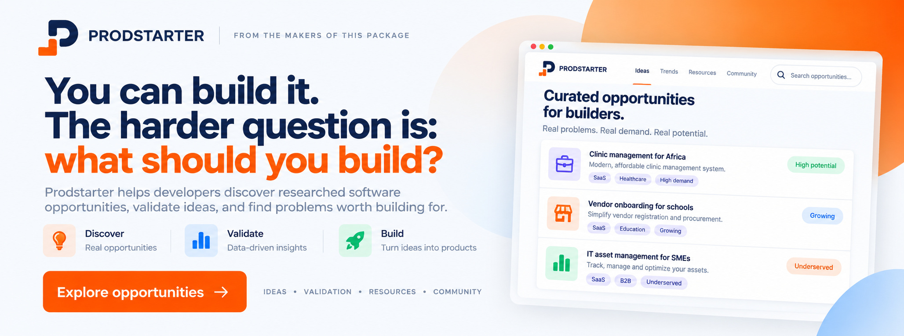

[](https://prodstarter.com/ecosystem/filament)

# Filament Forge Insights

[](https://packagist.org/packages/prodstarter/filament-forge-insights)
[](https://github.com/prodstarter/filament-forge-insights/actions/workflows/tests.yml)
[](https://github.com/prodstarter/filament-forge-insights/actions/workflows/phpstan.yml)
[](https://packagist.org/packages/prodstarter/filament-forge-insights)

A read-only [Laravel Forge](https://forge.laravel.com) integration for Filament. Give agencies, freelancers, and internal teams a client-safe infrastructure dashboard — servers, sites, deployments, SSL, scheduled jobs, queue workers, and databases — without ever handing out real Forge access.

Connect a Forge API token once, and everything renders from live (cached) Forge data through a Saloon-based API layer. There are no write endpoints anywhere in the plugin — it cannot deploy, restart, or reconfigure anything on your servers.

## Requirements

- PHP 8.3+
- Laravel 11, 12, or 13
- Filament 5

## Installation

Install the package via Composer:

```bash
composer require prodstarter/filament-forge-insights
```

The plugin ships its own settings table and registers its migration automatically — just run your normal migration command after installing:

```bash
php artisan migrate
```

Register the plugin on a panel, in your panel provider's `panel()` method:

```php
use Prodstarter\FilamentForgeInsights\FilamentForgeInsightsPlugin;

public function panel(Panel $panel): Panel
{
    return $panel
        // ...
        ->plugins([
            FilamentForgeInsightsPlugin::make(),
        ]);
}
```

Publish the plugin's compiled CSS so the dashboard renders styled out of the box:

```bash
php artisan filament:assets
```

That's it — a new **Infrastructure** navigation group appears in the panel with a **Settings** page for connecting a Forge account.

### Connecting a Forge account

1. Generate an API token from your [Forge account settings](https://forge.laravel.com/profile/api).
2. In the panel, go to **Infrastructure → Settings**.
3. Paste the token, pick an **Organization**, then click **Test Connection** and **Save**.

Everything else under the Infrastructure nav group (Overview, Deployments, Databases, Jobs, Workers) populates automatically once connected. Server, site, and SSL details live on the Overview page itself rather than as separate pages — see below.

### The Overview page

The Overview page is built to answer four questions at a glance — for the agency and for a client who doesn't know what a PHP version or a deployment is:

- **Is my site healthy?** — status cards for Website, Server, SSL, and the last Deployment, each colored using one consistent green / amber / red / gray health language.
- **Where is it hosted?** — a Server Overview and Site Information panel with provider, region, PHP/database versions, and an IP address that's masked by default (click to reveal).
- **Has anything changed recently?** — a 30-day deployment success/failure summary plus the 5 most recent deployments, with a link through to the full, paginated deployment history.
- **Is there anything I need to worry about?** — an Attention Required banner that only appears when something needs it (SSL expiring, a failed deployment, a server not responding). When everything's fine, it just says so.

The layout adapts to how the panel is scoped: the full client-facing layout above shows when scoped to a single site; scoping to a server or leaving it unscoped (whole organization) shows an equivalent, appropriately simplified view.

SSL certificate expiry isn't exposed directly by Forge's API — only issuance/renewal status and the last renewal timestamp. The plugin estimates an expiry date from that (Let's Encrypt certificates are issued for 90 days and Forge renews them well before then), rather than hiding the information or fabricating a source Forge doesn't provide.

### Scoping to a server or site

Agencies often run several clients' sites on one shared Forge server. The Settings page lets you narrow what a panel shows, in addition to the Organization:

- **Server** (optional) — show only this one server instead of the whole organization.
- **Site** (optional, requires a Server) — show only this one site on that server.

When scoped down to a single site, the Overview and Deployments pages narrow to match. Scheduled Jobs, Workers, and Databases are server-wide resources in Forge's API (they can't be attributed to a single site), so those pages are hidden entirely when a portal is scoped to one site among several on a shared server — this avoids surfacing another client's cron commands or database names.

## Configuration

Publish the config file if you want to set connection defaults via environment variables (useful for CI or non-interactive deploys) instead of the Settings page:

```bash
php artisan vendor:publish --tag="filament-forge-insights-config"
```

```php
return [
    'token' => env('FORGE_API_TOKEN'),
    'organization' => env('FORGE_ORGANIZATION_ID'),
    'server' => env('FORGE_SERVER_ID'),
    'site' => env('FORGE_SITE_ID'),
    'base_url' => env('FORGE_API_BASE_URL', 'https://forge.laravel.com/api'),
    'navigation_group' => 'Infrastructure',
    'cache' => [
        'servers' => 600,
        'sites' => 600,
        'deployments' => 120,
        'ssl' => 1800,
        'jobs' => 600,
        'workers' => 600,
        'databases' => 600,
    ],
];
```

Anything saved on the Settings page takes precedence over these values at runtime — the config file is a fallback, not the primary way most users will connect an account.

The plugin can also be configured fluently, which is handy for setting an agency-wide default that the Settings page can still override:

```php
FilamentForgeInsightsPlugin::make()
    ->token(env('FORGE_API_TOKEN'))
    ->organization('my-organization-slug')
    ->navigationGroup('Client Infrastructure')
    ->cacheFor(now()->addMinutes(5));
```

## Styling

The Overview page's cards and layout use Tailwind utility classes that Filament's own default stylesheet doesn't ship (it's purged down to only what Filament's core components use). To make this work without requiring every consumer to set up a custom panel theme, the plugin compiles and ships **its own small CSS bundle**, registered automatically through Filament's asset system — nothing to configure, it just needs publishing once via `php artisan filament:assets` (see [Installation](#installation)).

If your panel already has a [custom Filament theme](https://filamentphp.com/docs/panels/styling#creating-a-custom-theme), you can have your own build compile the plugin's classes too, so everything comes from one unified stylesheet instead of two separate ones. Add both of the plugin's directories to your theme's `@source` list (views for the Blade markup, `src` for a couple of classes generated dynamically in PHP):

```css
/* resources/css/filament/admin/theme.css */
@source '../../../../vendor/prodstarter/filament-forge-insights/resources/views/**/*';
@source '../../../../vendor/prodstarter/filament-forge-insights/src/**/*';
```

Then rebuild your theme (`npm run build`). The plugin's own bundle stays registered regardless — having both loaded isn't a problem, since a custom theme's build and the plugin's bundle compile from the same source classes.

## Testing

```bash
composer test
```

## Changelog

Please see [CHANGELOG](CHANGELOG.md) for more information on what has changed recently.

## Contributing

Please see [CONTRIBUTING](.github/CONTRIBUTING.md) for details.

## Security Vulnerabilities

Please review [our security policy](.github/SECURITY.md) on how to report security vulnerabilities.

## Credits

- [Stanley Ojadovwa](https://github.com/prodstarter)
- [All Contributors](../../contributors)

## License

The MIT License (MIT). Please see [License File](LICENSE.md) for more information.
